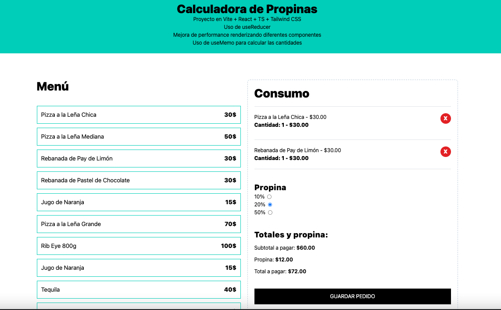

# ➗ Aplicación TPV para restaurante con cálculo de propinas

Proyecto creado con **Vite + React + TypeScript + Tailwind CSS**.  
TPV donde se puede elegir comida del menú, se añaden al listado de total, se puede añadir el porcentaje de propina y se realiza el cálculo. Se simula el botón de Guardar el Pedido para dejar vacía la orden.

---

## 🚀 Demo  
👉 [Pruébame aquí](https://aranda-react-tpv-with-usereducer.netlify.app/)  

---

## 🖼️ Vista previa 

  

---

## 🛠️ Tecnologías

- **Frontend**: [React 19](https://reactjs.org/) + TypeScript  
- **Estilos**: [TailwindCSS 4](https://tailwindcss.com/)  
- **Estado**: Hooks (`useReducer`, `useMemo`)  
- **Build Tool**: [Vite](https://vitejs.dev/)  

---

## ✨ Funcionalidades Clave

-   **Gestión de Órdenes**: Añade y elimina elementos del menú a la orden actual.
-   **Cálculo de Propinas**: Selecciona un porcentaje de propina y calcula el total a pagar.
-   **Formato de Moneda**: Uso de helpers con `Intl.NumberFormat` para mostrar los precios en formato de moneda local.
-   **Diseño Adaptable**: Interfaz completamente responsive gracias a Tailwind CSS.
-   **Rendimiento Optimizado**:
    -   Uso de `useReducer` para una gestión de estado centralizada.
    -   Cálculo de totales optimizado con `useMemo` para evitar recálculos innecesarios.
    -   Renderización selectiva de componentes para mejorar la performance.

---

## ⚙️ Instalación
Si quieres probar o modificar el proyecto en tu propio ordenador, sigue estos pasos:

1.  **Clona el repositorio**
    ```bash
    git clone (https://github.com/mariaaranda/react-tpv-calculator.git)
    cd react-tpv-calculator
    ```

2.  **Instala las dependencias**
    ```bash
    npm install
    ```

3.  **Inicia el servidor de desarrollo**
    ```bash
    npm run dev
    ```